<div align="center">

# 📋 TrelloApp - Modern Project Management

### *Organize your work. Supercharge your team. Ship faster.*

<p align="center">
  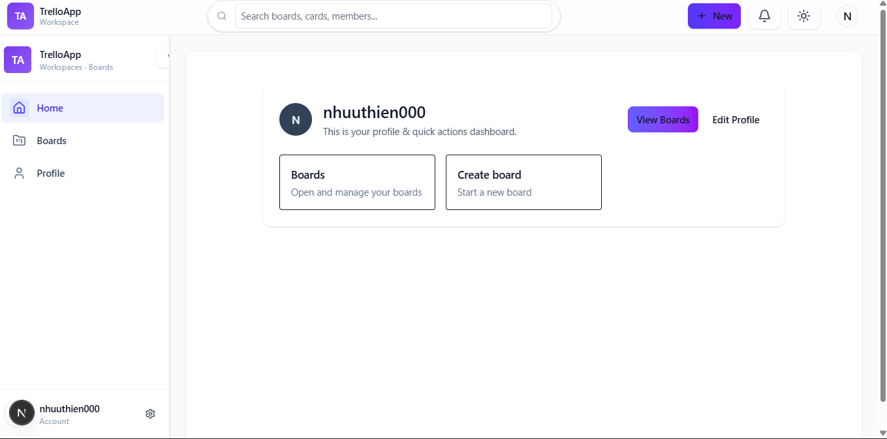
</p>


**[✨ Live Demo](#) • [📖 Documentation](#-documentation) • [🚀 Getting Started](#-quick-start) • [💬 Community](#)**

</div>

---

## 🌟 Why TrelloApp?

> **TrelloApp** is not just another task manager — it's a *powerful collaboration platform* designed for modern teams who want to move fast without breaking things.

<table>
<tr>
<td width="50%">

### ⚡ **Lightning Fast**
Real-time updates powered by Firebase. See changes instantly across all devices.

### 🎨 **Beautiful Design**
Modern, intuitive UI built with React 19 and Tailwind CSS 4. Works perfectly on any screen size.

</td>
<td width="50%">

### 🔐 **Secure by Default**
Email verification, JWT tokens, and Firebase security rules keep your data safe.

### 🚀 **Production Ready**
Built with Next.js 15, TypeScript, and Express.js. Deploy to Vercel in one click.

</td>
</tr>
</table>

---

## ✨ Features That Matter

<div align="center">

### 🎯 **Authentication Made Simple**

<p align="center">
  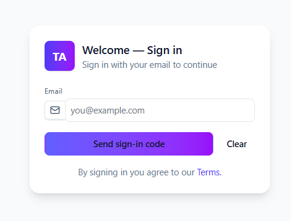
  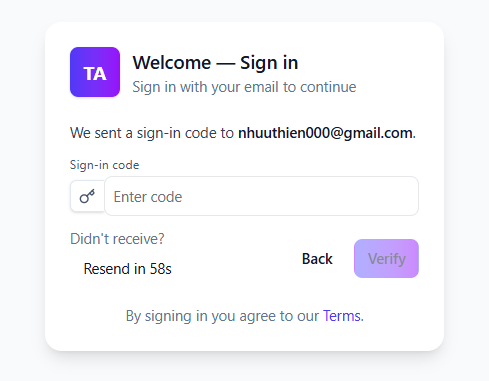
</p>

> *Passwordless authentication with email verification codes. No complex forms, no password reset headaches.*

</div>

---

<div align="center">

### 📊 **Powerful Kanban Boards**

<p align="center">
  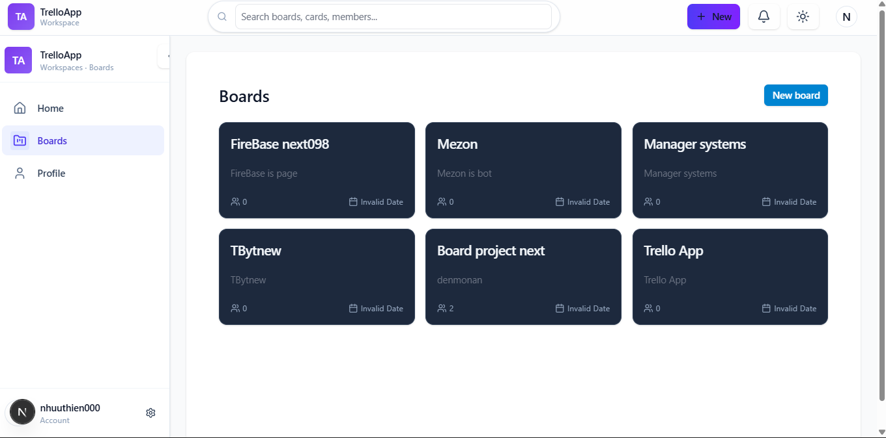
</p>

> *Drag-and-drop cards between columns. Add unlimited boards, cards, and team members.*

</div>

---

<div align="center">

### 🎨 **Intuitive Task Management**

<table>
<tr>
<td width="33%">
<p align="center">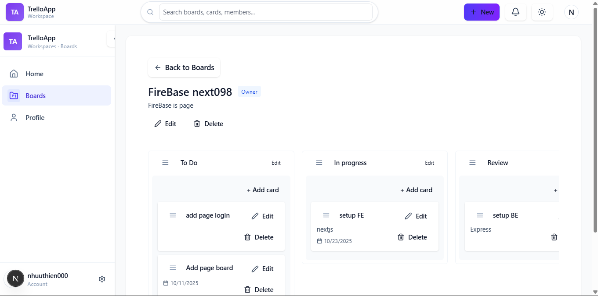</p>
<p align="center"><strong>Organize visually</strong></p>
</td>
<td width="33%">
<p align="center">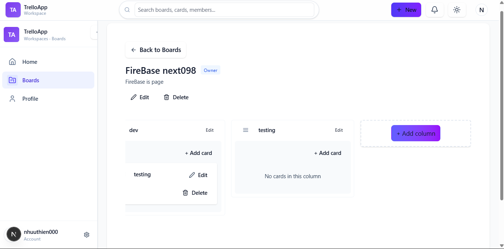</p>
<p align="center"><strong>Track progress</strong></p>
</td>
<td width="33%">
<p align="center">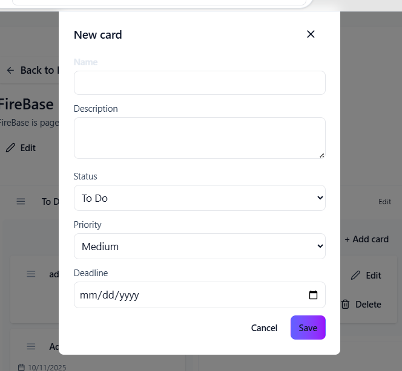</p>
<p align="center"><strong>Add cards instantly</strong></p>
</td>
</tr>
</table>

</div>

---

<div align="center">

### ⚙️ **Flexible Workflow**

<table>
<tr>
<td width="50%">
<p align="center">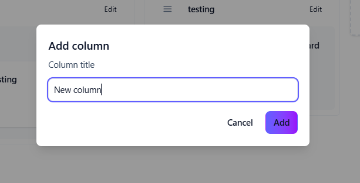</p>
<p align="center"><strong>Custom columns</strong><br/>Create your own workflow stages</p>
</td>
<td width="50%">
<p align="center">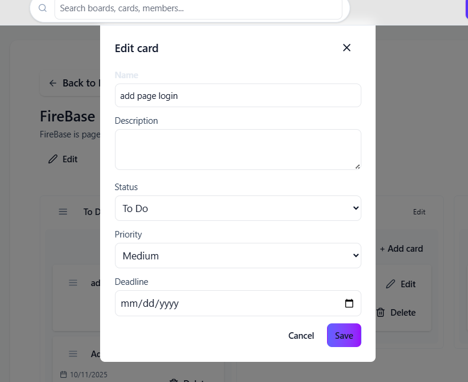</p>
<p align="center"><strong>Rich card details</strong><br/>Descriptions, deadlines, priorities</p>
</td>
</tr>
<tr>
<td width="50%">
<p align="center">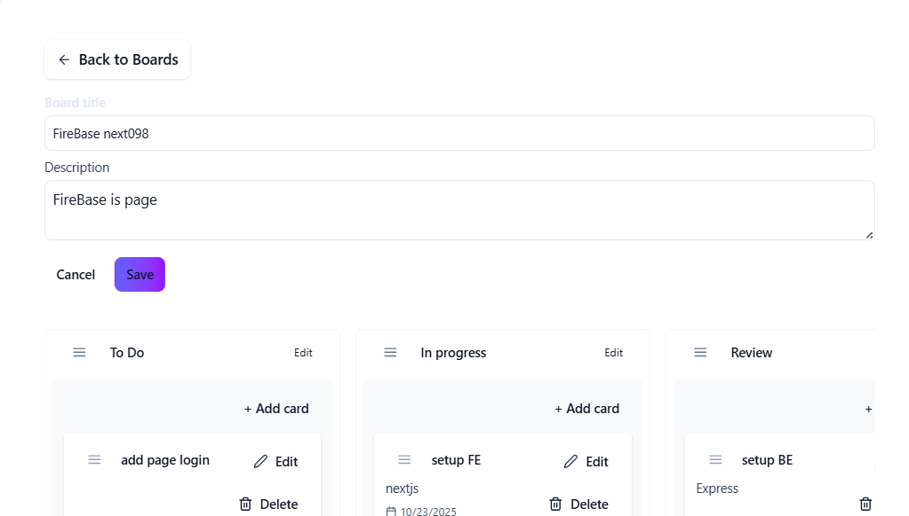</p>
<p align="center"><strong>Board settings</strong><br/>Customize titles and descriptions</p>
</td>
<td width="50%">
<p align="center">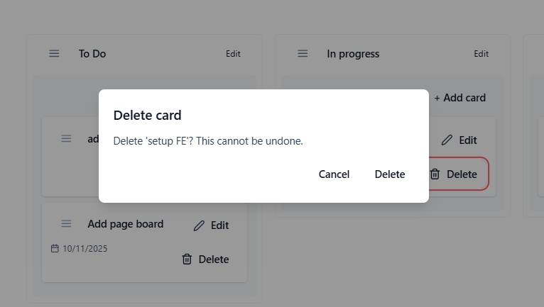</p>
<p align="center"><strong>Easy cleanup</strong><br/>Confirmation dialogs prevent mistakes</p>
</td>
</tr>
</table>

</div>

---

<div align="center">

### 👤 **User Management**

<p align="center">
  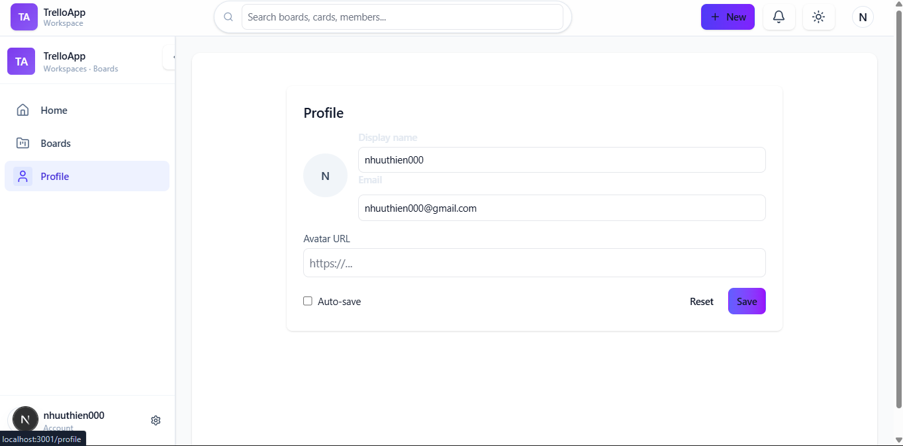
</p>

> *Manage your profile, customize settings, and track your work across all boards.*

</div>

---

<div align="center">

### 🗑️ **Smart Confirmations**

<p align="center">
  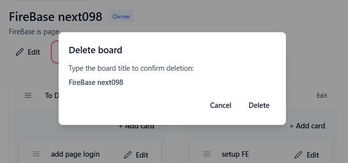
</p>

> *Accidental deletions? Never again. All destructive actions require explicit confirmation.*

</div>

---

<div align="center">

### 🎯 **Board Creation**

<p align="center">
  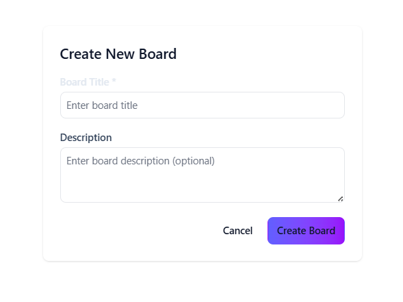
</p>

> *Start new projects in seconds. Give it a name, add a description, and you're ready to go.*

</div>

---

## 🎯 Key Features

<table>
<tr>
<td width="50%" valign="top">

### 🔥 **Core Functionality**
- ✅ **Drag & Drop** - Smooth card movement with DnD Kit
- ✅ **Real-time Sync** - Live updates via Firebase
- ✅ **Email Auth** - Passwordless verification codes
- ✅ **Responsive Design** - Works on all devices
- ✅ **Dark Mode Ready** - (coming soon)

</td>
<td width="50%" valign="top">

### 💼 **Team Collaboration**
- ✅ **Multi-user Boards** - Invite team members
- ✅ **Task Assignment** - Assign cards to members
- ✅ **Custom Workflows** - Create your own columns
- ✅ **Priority Levels** - High/Medium/Low priorities
- ✅ **Deadlines** - Track due dates

</td>
</tr>
</table>

---

## 🚀 Quick Start

### Prerequisites
- Node.js 18+ or 20+
- pnpm (recommended) or npm
- Firebase account (free tier works!)

### Setup in 3 Steps

#### 1️⃣ **Clone & Install**
```bash
# Clone the repository
git clone https://github.com/yourusername/trello-app.git
cd trello-app

# Install dependencies
cd frontend && pnpm install
cd ../backend && pnpm install
```

#### 2️⃣ **Configure Environment**
```bash
# Backend (.env)
cp backend/.env.example backend/.env
# Add your Firebase credentials and JWT secret

# Frontend (.env.local)
cp frontend/.env.example frontend/.env.local
# Add your Firebase client config
```

#### 3️⃣ **Run Development Servers**
```bash
# Terminal 1 - Backend
cd backend
pnpm run dev

# Terminal 2 - Frontend
cd frontend
pnpm dev
```

**🎉 Open http://localhost:3000 and start organizing!**

---

## 📖 Documentation

Detailed setup guides are available for both frontend and backend:

- **[Frontend Setup Guide](./frontend/SETUP.md)** - Next.js, React, TypeScript configuration
- **[Backend Setup Guide](./backend/SETUP.md)** - Express.js, Firebase Admin setup

### Architecture Overview

```
┌─────────────────────────────────────────────────────────────┐
│                        TrelloApp                             │
├─────────────────────────────────────────────────────────────┤
│                                                               │
│  Frontend (Next.js 15 + React 19)                           │
│  ├─ App Router (file-based routing)                         │
│  ├─ TypeScript (type-safe code)                             │
│  ├─ Tailwind CSS (utility-first styling)                    │
│  └─ DnD Kit (drag and drop)                                 │
│                                                               │
│  ────────────────── REST API ──────────────────             │
│                                                               │
│  Backend (Express.js 5 + Firebase Admin)                    │
│  ├─ JWT Authentication                                       │
│  ├─ Cloud Firestore (NoSQL database)                        │
│  ├─ SendGrid (email delivery)                               │
│  └─ Express Validator (input validation)                    │
│                                                               │
└─────────────────────────────────────────────────────────────┘
```

---

## 🛠️ Tech Stack

<div align="center">

### **Frontend**


### **Backend**


</div>

---

## 📦 Project Structure

```
trello-app/
├── 📂 frontend/          # Next.js application
│   ├── src/
│   │   ├── app/         # Pages (App Router)
│   │   ├── components/  # React components
│   │   ├── context/     # Global state
│   │   ├── hooks/       # Custom hooks
│   │   ├── services/    # API client
│   │   └── types/       # TypeScript types
│   ├── public/          # Static assets
│   └── package.json
│
├── 📂 backend/           # Express.js API
│   ├── controllers/     # Route controllers
│   ├── middleware/      # Auth middleware
│   ├── routes/          # API routes
│   ├── services/        # Business logic
│   ├── scripts/         # Seed scripts
│   └── package.json
│
├── 📂 demo/              # Screenshots for README
└── README.md            # This file
```

---

## 🎨 Screenshots Gallery

<details>
<summary><b>👉 Click to see more screenshots</b></summary>

<br/>

### Authentication Flow
 

### Dashboard & Boards


### Kanban Views
 

### Card Management
 

### Column & Board Management
 

### Settings & Confirmations
 
 

</details>

---

## 🤝 Contributing

We welcome contributions from the community! Here's how you can help:

### Development Workflow
1. **Fork** the repository
2. **Create** a feature branch: `git checkout -b feature/amazing-feature`
3. **Commit** your changes: `git commit -m 'feat: add amazing feature'`
4. **Push** to the branch: `git push origin feature/amazing-feature`
5. **Open** a Pull Request

### Commit Convention
We follow [Conventional Commits](https://www.conventionalcommits.org/):
- `feat:` ✨ New features
- `fix:` 🐛 Bug fixes
- `docs:` 📚 Documentation updates
- `style:` 💄 Code style changes
- `refactor:` ♻️ Code refactoring
- `test:` 🧪 Adding tests
- `chore:` 🔧 Maintenance tasks

---

## 📄 License

This project is licensed under the **MIT License** - see the LICENSE file for details.

---

## 🙏 Acknowledgments

Built with these amazing open-source projects:
- [Next.js](https://nextjs.org/) - The React Framework
- [Firebase](https://firebase.google.com/) - Backend-as-a-Service
- [Tailwind CSS](https://tailwindcss.com/) - Utility-first CSS
- [DnD Kit](https://dndkit.com/) - Drag and drop toolkit
- [Lucide Icons](https://lucide.dev/) - Beautiful icons

---

## 📞 Support & Community

- 💬 **[Discussions](https://github.com/yourusername/trello-app/discussions)** - Ask questions, share ideas
- 🐛 **[Issues](https://github.com/yourusername/trello-app/issues)** - Report bugs or request features
- 📧 **Email**: thiennguyenhuu3@gmail.com
- 🌐 **Website**: 

---

<div align="center">

### ⭐ Star us on GitHub — it motivates us a lot!

**[⬆ back to top](#-trelloapp---modern-project-management)**

---

<p align="center">
  Made with ❤️ by <a href="https://github.com/yourusername">iamhuuthien</a>
</p>

<p align="center">
  <a href="https://github.com/yourusername/trello-app">
    
  </a>
  <a href="https://github.com/yourusername/trello-app/network/members">
    
  </a>
</p>

</div>
